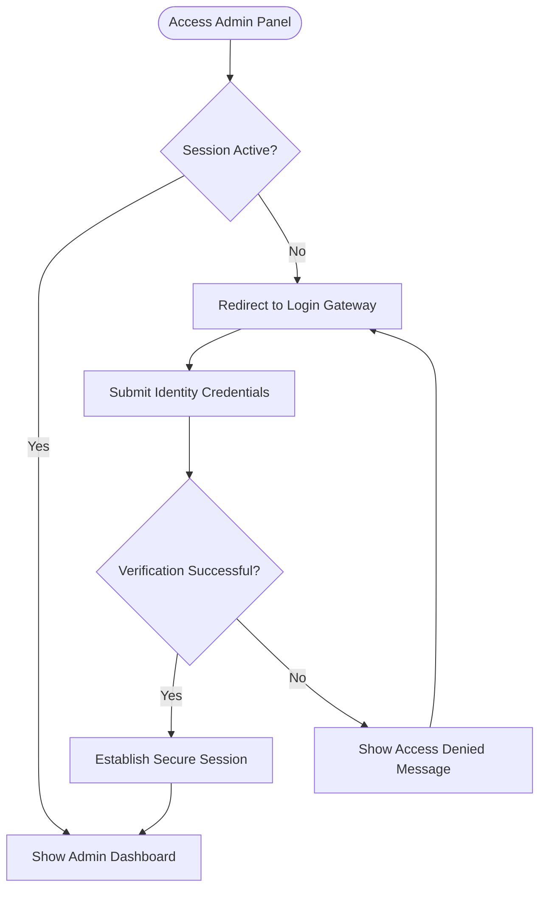
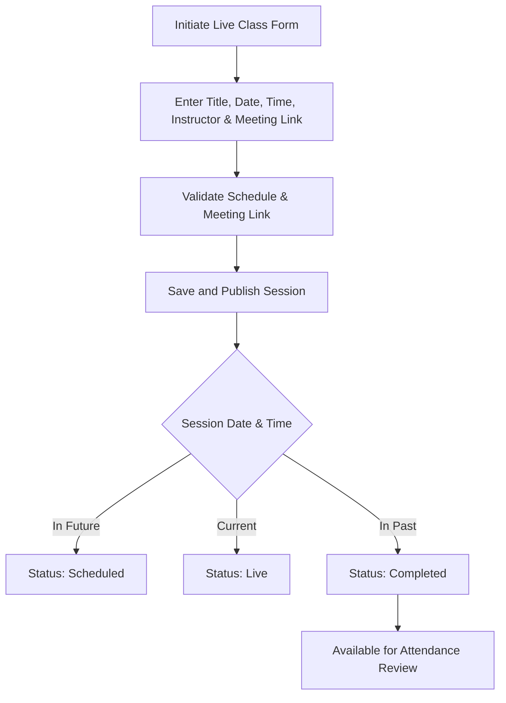
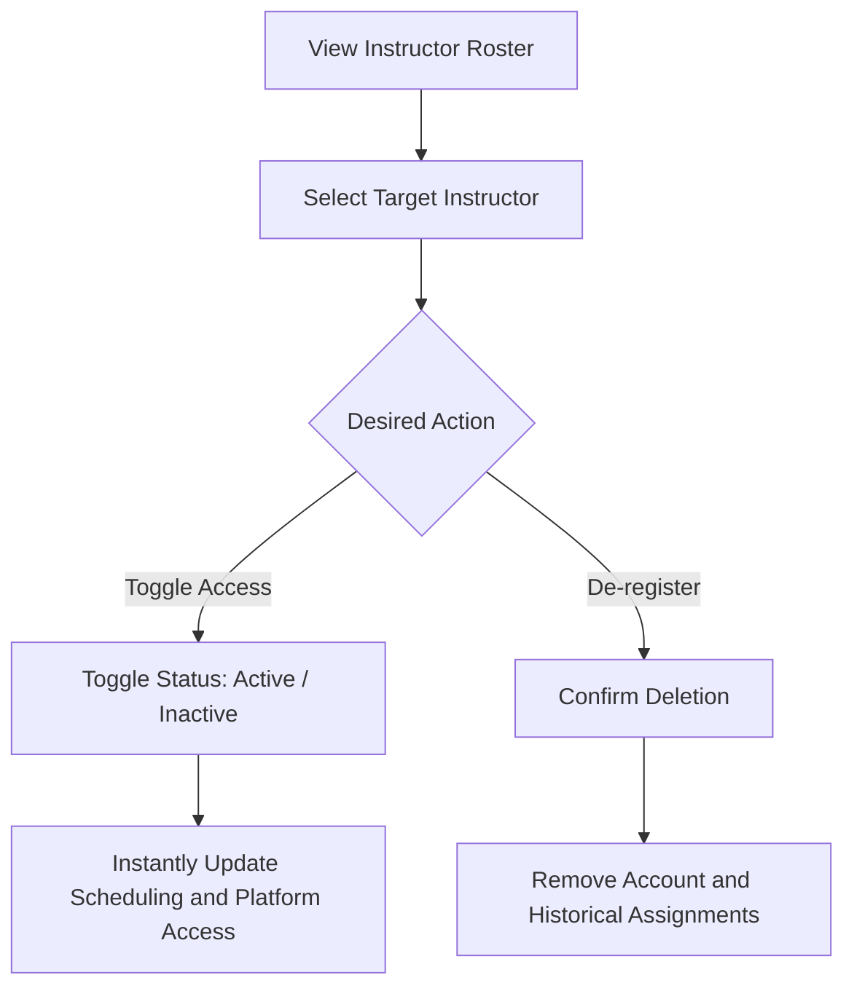

# LurnStack Admin Panel: Theoretical & Workflow Overview

This document provides a clean, professional, and purely conceptual overview of the **LurnStack Admin** system. It explains the project's purpose, architectural design, core modules, and business workflows without referencing technical implementation details, code locations, or API endpoints.

---

## 1. Project Purpose & Mission

**LurnStack Admin** serves as the administrative hub for the LurnStack educational ecosystem. Its primary mission is to empower administrators to orchestrate online learning activities, oversee user account lifecycles, and coordinate live instructional sessions. The platform acts as the bridge connecting course schedulers, instructors, and registered students.

---

## 2. Core Functional Modules

The system is organized into several distinct functional modules, each addressing a key aspect of platform administration:

### 2.1 Identity and Access Management
*   **Purpose:** Ensures that only authorized administrators can modify curriculum data, schedule events, or manage users.
*   **Concept:** Administrators identify themselves via a secure login process. Once verified, their session state is maintained across page visits. Unauthenticated users are automatically redirected to a secure sign-in gateway to protect administrative views from unauthorized access.

### 2.2 Operational Dashboard
*   **Purpose:** Provides a real-time, high-level pulse of platform engagement.
*   **Concept:** Aggregates and displays critical platform-wide metrics, such as the total volume of registered students and active trainers. This module serves as the administrative landing pad, giving managers immediate insight into the current size and health of the user base.

### 2.3 Live Session Scheduler
*   **Purpose:** Coordinates live, interactive classes between instructors and student groups.
*   **Concept:** Allows administrators to plan, schedule, update, or cancel live classes. For each class, the system captures scheduling details (date, duration, and time), course associations, instructor assignments, descriptive summaries, and access credentials (meeting links). The system automatically tracks the lifecycle of these sessions (classifying them as scheduled, live, or completed) based on the calendar timeline.

### 2.4 Attendance and Engagement Tracking
*   **Purpose:** Audits student participation and attendance reliability.
*   **Concept:** For each live session, the system records student arrivals. It monitors the exact moments students join a class and classifies their attendance status (e.g., Present vs. Late). Administrators can review these engagement records and export summaries to assess student participation over time.

### 2.5 Student Directory Administration
*   **Purpose:** Maintains a clean roster of the student body.
*   **Concept:** Lists registered students along with their contact information and signup timelines. Administrators can review profiles and permanently remove accounts to keep directories up to date.

### 2.6 Instructor / Trainer Management
*   **Purpose:** Governs the pool of educators allowed to teach on the platform.
*   **Concept:** Manages the active roster of instructors. Admins have the ability to toggle an instructor's status (Active or Inactive) instantly, allowing quick control over scheduling privileges and platform access, as well as the ability to remove trainer accounts entirely.

---

## 3. High-Level Conceptual Workflows

The following diagrams and descriptions detail how information flows through the system to accomplish key administrative goals.

### 3.1 Authentication & Session Flow
When an administrator accesses the application, their session goes through a security check:

### 3.2 Live Class Coordination Flow
Creating and managing live learning sessions follows a strict validation and scheduling sequence:

### 3.3 User Moderation Workflow
Enforcing access control for instructors is managed via status propagation:

